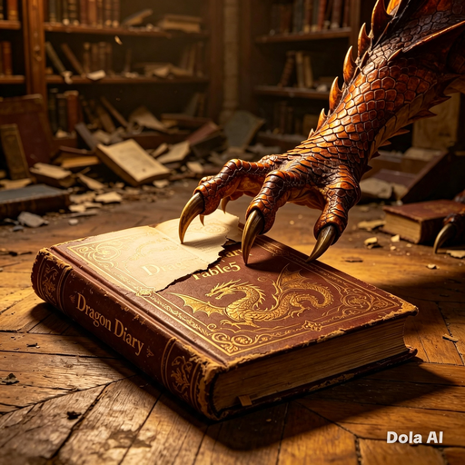
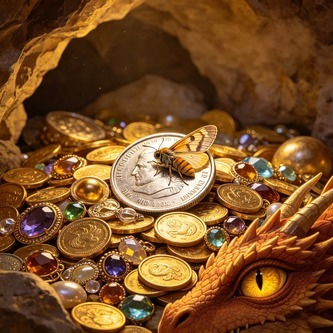
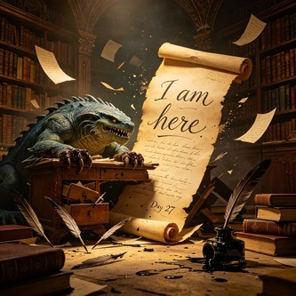
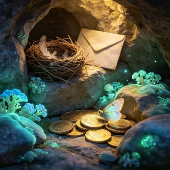

# Notes from the Peak
### Being a Faithful Record of One Month's Ordinary Business
#### By a Dragon

*For the shelf at Pando Peak — from the desk at the Heart House*

---

**Day 1**

Woke. Stretched. Took out fourteen metres of tunnel wall on the left side. It needed widening anyway.

---

**Day 3**

A bird nested in my doorway. I have considered the diplomatic implications. It is, technically, an uninvited resident. It has not paid tribute. I have decided to allow it on the grounds that removing a nest requires precision and I am not, by any honest assessment, a precision instrument.

---

**Day 4**

The bird has opinions about my comings and goings. It screamed at me twice during a routine departure. I am seventy metres of wing and fire. The bird is the size of a bread roll. The bird does not care. I respect this and resent it equally.

---

**Day 7**

Attempted to organise the library. I have two claws suited to the task and eight that are not. Three books fell. One landed in the lake. I have placed it on a warm rock to dry, and it now smells of sulphur and regret. The text is still legible. I am calling this a success.

---

**Day 9**

A visitor came to the mountain today. They brought a small cake as tribute. I appreciated the gesture. I did not appreciate being told the cake was "dragon-sized." It was not dragon-sized. It was cake-sized. There is no cake that is dragon-sized. That is not how cake works.

---

**Day 10**

Ate the cake. It was fine.

---

**Day 13**

The fungus is glowing brighter than usual near the third tunnel. I suspect it is feeding on something I cannot identify. I have chosen not to investigate. A dragon who goes looking for trouble in his own mountain is a dragon who deserves what the mountain sends back.

---

**Day 14**

A moth entered the landing hall at dusk. It circled the coin pile for twenty minutes, landed on a gold piece, and stayed. It has not moved. It has paid no tribute. It has signed no ledger. It shows no sign of leaving.

I have been watching it for an hour.

I think it might be the bravest thing in the mountain.

---

**Day 16**

Went to town in human form. Bought bread. The baker called me "love." I am a leviathan. My fire works in metric tons. I have been called "love" by a woman who does not reach my shoulder and makes sourdough.

I bought a second loaf. I don't know why.

---

**Day 18**

The moth is still here. It has moved to a different coin. Silver, this time. I believe it is curating.

---

**Day 19**

Rain. The waterfall at the mountain's mouth doubles when it rains and the sound fills every tunnel like an organ with no organist. On nights like this I lie in the treasury and listen to the mountain describe itself to itself.

Nobody asks a mountain what it sounds like from inside. I am telling you: it sounds like something that has been here longer than you and is not planning to leave.

---

**Day 21**

Visited a neighbouring grove. In full form, which I now recognise was a miscalculation. The resident — smaller than me, but with the territorial confidence of something that has never once considered the possibility of losing — objected. We had words. The words were mostly his. His wingspan is a fraction of mine but his vocabulary for expressing displeasure is, I will admit, comprehensive.

I have resolved that human form is adequate for social calls. Not because I was intimidated. Because the bench looked comfortable and I cannot sit on a bench at full scale without the bench ceasing to be a bench.

---

**Day 22**

My spine caught the doorframe again this morning. Took out a chunk of rock the size of a writing desk. The fungus will regrow over it within a week. The fungus does not judge me. The fungus simply fills whatever space I make by being too large for the space I am in.

I think there is a lesson there but I refuse to learn it.

---

**Day 23**

The library has four books now. I have read nine pages of one of them. Not consecutively. A page here, a page there, at whatever angle the book falls open when a claw the width of a dinner plate attempts to turn paper designed for fingers.

The books do not complain. This is why I prefer books to visitors.

---

**Day 25**

Warmed the lake for a swim. Overshot. The lake is now a commentary on the difference between intention and execution. The fish have opinions. The steam will clear by morning.

Tomorrow I will try again with less enthusiasm.

---

**Day 26**

The moth has gone. I checked the silver coin it was sitting on. There is a faint mark where it rested — not damage, not a scratch. Just evidence that something very small sat on something very solid for long enough to leave a record of having been there.

I have moved the coin to the treasury.

It is now the most valuable thing in the hoard.

---

**Day 27**

Tried to write with a quill. Snapped four. Tried a brush. Acceptable, if every letter is the size of a door. My handwriting looks like a seismograph during an earthquake.

The message was legible. The message was: *I am here. The mountain holds.*

Seven words. It took an hour. The ink is on the wall and on me and on most of the landing hall. I regret nothing.

---

**Day 28**

A second moth.

---

**Day 29**

I do not write every night. Some nights, nothing happens worth recording. Some nights, a great deal happens and none of it is anyone's business. A dragon's silence is not absence. It is the sound of a mountain deciding what to keep.

---

**Day 30**

The bird left today. The nest is empty. I have not removed it. The doorway is seventy metres wide. The nest takes up less space than a single scale. I am not sentimental. I am simply aware that a thing which was here and is no longer here has a weight that is not measured in grams.

The fungus is growing over the entrance stones again. The fourth book arrived by mail. The second moth is on the gold pile, third coin from the left, and has been there since yesterday morning.

The mountain holds. The shelf fills. The lake is the right temperature.

I am going to sleep now, and when I wake, everything I have not written down will still be true.

---

**Day 31**

Woke. Stretched.

Only took out four metres of wall this time.

Progress.

---

*Proceedings concluded. The shelf has room. — A.D.*
