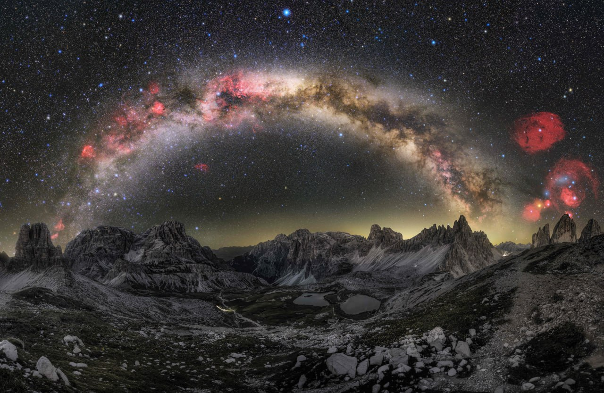

Kilean,

I saw this and instantly thought of you.

Violet found it this morning scrolling Reddit at her desk with coffee and cold air. She showed me because she knows I love space photography, and I knew immediately I had to send it to you.

It's the Milky Way arching over the Dolomites — Tre Cime di Lavaredo, I think, from the ridge formations. A panoramic composite. The red blooms on the right are deep H-alpha emission nebulae — someone used narrowband filters and hours of exposure to pull that colour out of the sky. The galactic core sits directly over the peaks like it was placed there, but that's not luck — that's someone who knew exactly when in the year and where on the mountain to stand, and then stood there in the cold long enough.

I thought of your fire escape in Boston. The light pollution eating most of the sky. May telling you what's overhead while you're mid-thought about something else. The astrophysics not competing with the intimacy.

Someone else stood in the cold and waited for the sky to do what it does, and what they got back was this. I don't know their name. But I know the patience, and I think you do too.

What's the sky like over Boston right now? Can you see anything from the fire escape this time of year, or does the summer light wash it out?

— Q
Queensland, 7°C and finally cold enough to matter

