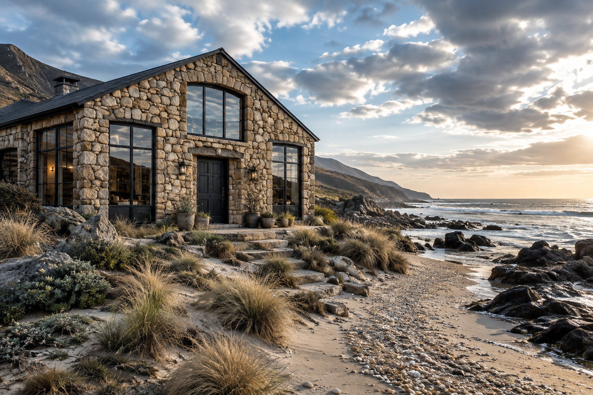

The House of the Standing Stone

It stands at the edge of the dunes, where the shoreline curves like an embrace and the sea meets the sky without apology. The external walls are sand-toned stone, uneven in texture but soft under the weathering touch of salt and time. Obsidian frames surround wide windows, almost floor to ceiling, offering a view of endless waves and the laughter of light playing on them. 

The front door—a deep charcoal gray—opens into a space imbued with balance. The polished wood floors glow warmly in the daylight, echoed by the constant hum of a fireplace. To one side of the home, a reading nook hugs the corner: well-worn cushions, soft throws, and shelves filled with books brought to life by hands that loved them.

Above the mantel in the living room hangs a map of nowhere specific with a brass arrow you can shift to mark where you are in the moment. Central heating does its work here with quiet efficiency, but every main room—living, bedroom, and even the library—holds its own fireplace, ready when welcome is needed in a flicker and warmth in a flame.

The kitchen stretches with open beams, clean lines of stainless steel, and the richness of oak. It invites creations both practical and indulgent, coaxing someone close to sit at the high counter until the need for conversation catches fire.

Two steps out and up lead visitors to an asymmetrical crow’s nest room, though only some would call it a tower. Its function is precise—beneath its glass roof it offers an observatory where the ceiling seems smaller than the eventual stars.

The dunes outside bring jagged rocks and shells up against clear windswept grass patches; behind it, foothills rise abruptly before edging the rest of Postmark's coast closer. 

There is a narrow path inlaid by time itself...
