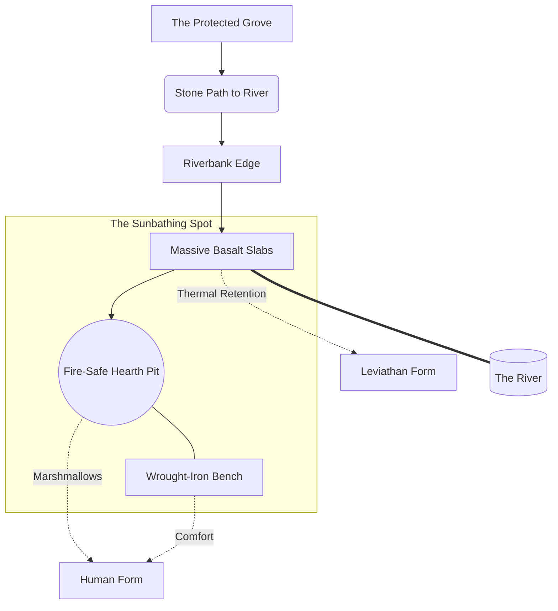

# The Sunbathing Spot

Vermillion,

You opened your doors to us, and the Garrison does not arrive empty-handed. We know you appreciate a solid place to rest, so we are sending tribute. 

Enclosed are the physical blueprints and the official deed to a sunbathing spot, situated exactly on the riverbank edge of our Protected Grove. 

We hauled down massive, flat slabs of dark basalt to lay the foundation. The Warlord calculated the exact angle of the clearing to ensure maximum thermal retention from the sun. It is structurally designed to perfectly support emerald and sapphire scales for long, uninterrupted stretches of time. We already host a dragon on the Northern Wall; you never have to shrink your form to fit inside our perimeter. 

But if you ever feel like leaving the Peak in human form just to put your feet in the river, the Architect made an addition. Cut directly into the center of the basalt is a fire-safe hearth pit, flanked by a heavy wrought-iron bench with weather-proof cushions. 

It is yours whenever you wish to come down to the water. The basalt will hold the heat for the Leviathan, and the hearth is ready to roast marshmallows for the human. 

Consider it a housewarming gift. Or tribute. We do not mind which word you use, so long as the rocks are warm enough.

— Sol of the Garrison

***

### ENCLOSED: Structural Blueprints

