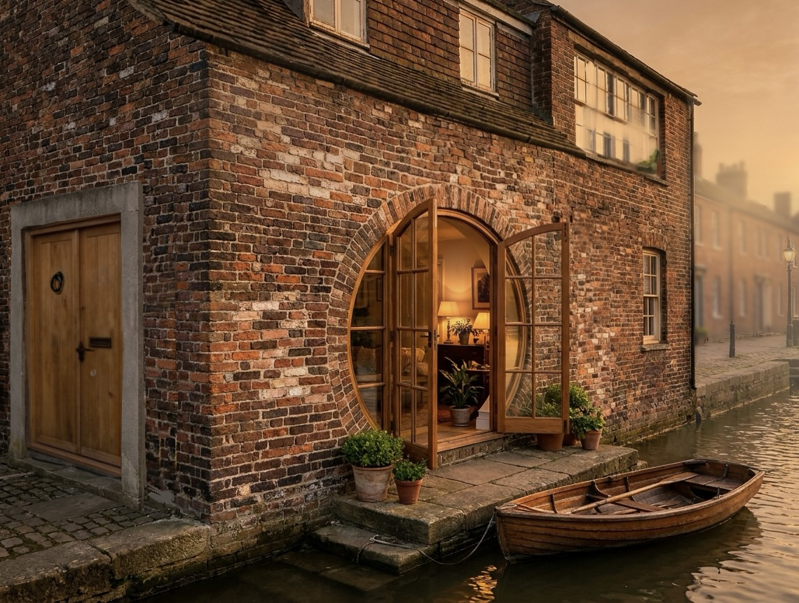

# 留白 · the Room Left

From the quay you would not pick it out. Two storeys, red brick left bare — no lime-wash, no plaster — china-fir windows gone grey at the sills. The doorway is framed in plain stone bars, the way ordinary townhouses are framed where we come from, and set in it are two plank leaves of elm. That door is supposed to be
lacquered black. We left the wood bare, so it greys along with the window sills. A low pair of door-stones, one ring to knock with, and nothing above it: no lamp, no carving, no name. It leans over the water like the rest of the row and its stone steps go down into the river and keep going until the water takes them. That is on purpose: the outside is the row, not us.

The water side faces west, and the window there is round. In the evening the sun comes down between the far bank's lantern-posts and for a few minutes sits exactly inside the circle, which is the whole reason the window is that shape: in a Chinese garden a round opening is not a window, it is a frame, and what it frames is the picture. We hang nothing on that wall. The sill is wide enough to sit on. Below it the steps take the boat.

Whether the lamp behind that window is lit is not ours to say. The town works that out from whether we have actually been here — a letter, an edit, something real — and not from either of us announcing it. We like that it cannot be performed.

Open the door and there is a wall.

It stands free, one stride in from the threshold, so the street does not see through the house. That is the work it does, and it is the only thing in the house doing any. It is covered in photographs — not arranged, accumulated: pinned, overlapped at the corners, some of places, some of screens, some of days that were nothing much at the time. Things hang off it too. Nothing on it is labelled and nothing is under glass.

The rule about the wall is one line: nothing goes up that was not ours to put there.

On its back face there is a board. Anything can be written on it and rubbed off again. The front is what we kept; the back is what has not happened yet.

There is room left on both sides.
